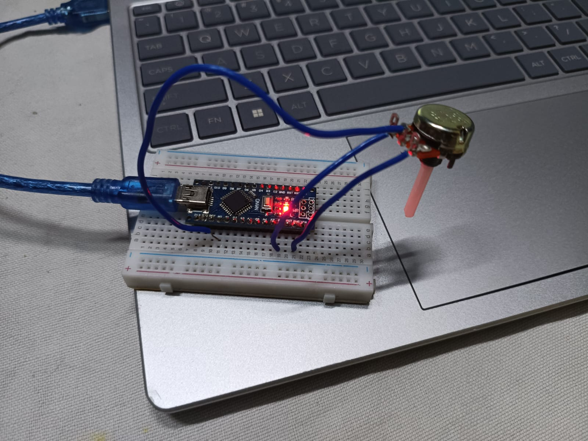

⚡ Digital Voltmeter using Arduino

A simple and efficient digital voltmeter built using Arduino to measure real-time voltage (0–5V) using the built-in ADC.

📌 Overview

This project demonstrates how analog signals can be converted into digital values using Arduino's Analog-to-Digital Converter (ADC). The measured voltage is displayed in real-time using the Serial Monitor.

🧠 Concepts Covered

- Analog to Digital Conversion (ADC)
- Voltage Divider Principle
- Serial Communication (UART)
- Real-time Data Monitoring

## 🧰 Components Required

 Arduino Uno     
 Potentiometer          
 Breadboard      

## 🔌 Circuit Connection

- Connect one end of potentiometer → 5V
- Connect other end → GND
- Connect middle pin (wiper) → A0 (Analog Pin)

## 💻 Arduino Code
[view code](digital-voltmeter.ino)

##⚙️ Working Principle
The potentiometer acts as a voltage divider, producing a variable voltage between 0V and 5V.
Arduino reads this analog voltage using its 10-bit ADC, which converts it into a value between 0 and 1023.
The voltage is calculated using:
Voltage = ADC Value × (5.0 / 1023.0)
The result is continuously displayed on the Serial Monitor every 300 milliseconds.

📊 Output
Example Serial Monitor Output:

Voltage: 0.85 V (low)
Voltage: 2.31 V (mid)
Voltage: 4.72 V (high)

🔧 Real Hardwaresetuop

🎥 Demo Video
[video](https://youtube.com/shorts/ASisU032lhg?si=mwJoCc1C1EszUUYF)

🎯 Learning Outcome
Understood how ADC works in embedded systems
Learned real-time sensor data processing

⭐ Status
✅ Completed
